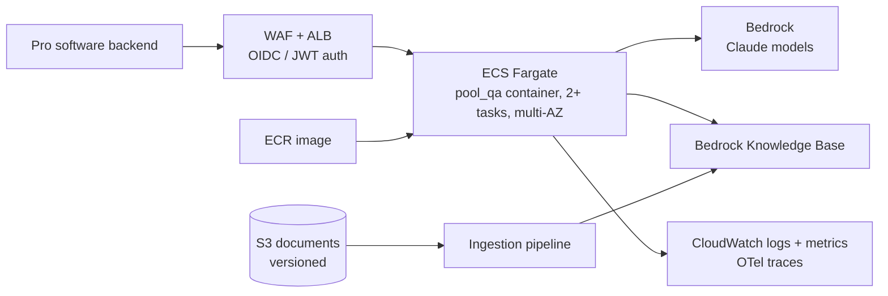

# Deployment

How this service would run in production on AWS. **Today** marks what the repository does now; everything else is proposed. Items marked *to verify* depend on AWS capabilities not checked for this draft. Design simplifications are listed once in `DESIGN.md` § Known limitations.

## 1. Scope

- Deployed unit: the `pool_qa` API (`POST /ask`), called by Fluidra's existing software for pool professionals. No standalone chat frontend.
- Users: pool professionals and support staff. Answers cite the documents or abstain; the technician remains responsible for the work.
- Corpus today: one manual, English pages indexed. Target: many brands, product lines, languages and document types, with service bulletins superseding manuals.
- **Today:** a container image (`Dockerfile`) serving the stateless API, configured by environment variables, with CI running lint and tests.

## 2. Target architecture

- **Region:** one EU region; Bedrock models through EU cross-region inference (*to verify*: model availability and that data stays in the EU).
- **Compute:** ECS Fargate. The service is stateless and I/O-bound, so tasks scale on concurrent requests, not CPU. AgentCore Runtime is the alternative if Fluidra standardises on it; the LangGraph graph would move unchanged (*to verify*).
- **Entry:** ALB with WAF. A request can run up to the 180 s deadline, which exceeds API Gateway's default integration timeout (*to verify* current limits), so the ALB idle timeout is set above the deadline.
- **Models:** Bedrock replaces the Anthropic API. Tasks use an IAM role; no API keys.
- **Retrieval:** Bedrock Knowledge Base behind the existing `search()` interface.

## 3. From repo to production

| Component | Today | Production |
|---|---|---|
| Model per agent | Config string, Anthropic API key | Bedrock model IDs via `langchain-aws` (new dependency); `llm.py` maps Bedrock errors to `ProviderError` (D29) |
| Structured output | Function calling | Same through Bedrock Converse tool use (*to verify* per model) |
| `search(query, filters, k)` | In-memory BM25 over `data/chunks.jsonl` | Knowledge Base retrieve with metadata filters; hybrid search (*to verify*). Citation and quote checks keep working on returned chunk text |
| Corpus | Committed JSONL, loaded at startup | Versioned index built by the ingestion pipeline |
| Config and secrets | `pydantic-settings`, `.env` | Task environment from SSM Parameter Store; no secrets needed with IAM |
| Conversation state | Client sends `history` | Same; server-side or signed history once clarification limits must be enforced |
| Logs | One JSON line per graph node: `request_id`, ms, tokens per model | Same lines shipped to CloudWatch, plus OTel traces |
| Limits | LLM timeout, retries, 180 s deadline, 3 searches per Researcher run, 1 revision | Plus rate limits, input size caps, token budget per request (§6) |
| Build | `uv.lock`, Dockerfile, CI: ruff + pytest | Image built in CI, tagged with the commit SHA, pushed to ECR |

## 4. Knowledge pipeline

- Source documents in versioned S3 with metadata the `Chunk` schema already carries: `document`, `source_type`, `effective_date`, `language`. Product and brand are added as filter fields when the corpus holds several products.
- Ingestion runs offline, never in the request path. Each run produces a new index version; the service switches only after the eval passes on it.
- Before trusting managed parsing, check per document family against golden questions:
  - troubleshooting matrices keep the link between symptom and cause (plain text extraction lost it on page 13);
  - facts that exist only in figures (Fig. 4, installation zones) are recoverable or flagged as not covered;
  - page numbers and section headings survive, so citations point to a place the technician can open;
  - safety warnings stay in the same chunk as their procedure.
- Hand transcriptions (D27) do not scale; they are replaced by layout-aware parsing or VLM figure descriptions, checked the same way.
- **Languages:** indexing only English works because this manual's language sections are parallel. With asymmetric coverage across documents, all languages are indexed, parallel passages deduplicated, and answers stay in the technician's language.
- **Authority:** bulletins supersede manuals; ranking uses `source_type` and `effective_date`.

## 5. Release and evaluation

1. **Every change:** CI runs ruff and pytest (today), then builds the image.
2. **Changes to prompts, agents, model IDs, retrieval or index:** the eval runs against staging with Bedrock models, under a stated cost budget. Gates as in `DESIGN.md` § Evaluation. Today the eval is manual, 5 questions, one run each.
3. **Before gates can block releases:** the golden set grows from pilot questions, and each question runs several times to report pass rates instead of single outcomes.
4. **Release manifest:** image SHA, model IDs, index version. An answer can be traced to all three.
5. **Rollout:** canary on a share of traffic, compare outcome mix, latency and error rate with the current version, then promote. Rollback returns to the previous task definition and index version.
6. **Pilot:** one market and one group of technicians before wider release.

## 6. Operations

### Observability

- **Today:** per-node JSON logs with latency, outcome, verdict, issues and token counts. Logs do not include question text; Verifier `issues` can quote answer content.
- Added: OTel traces per request covering agent steps and tool calls (Langfuse or CloudWatch as backend); `request_id` returned to the caller to join feedback to traces.
- Metrics and alarms: outcome mix (answer, clarify, abstain, refuse), revision rate, malformed-output rate, 502 and 504 rates, p50/p95 latency, tokens and cost per request.

### Cost and latency

- An answered request makes several sequential model calls: Intake, a Researcher tool loop (one call per search plus submit, capped at 7 per run), the Verifier, and on revision a second Researcher run and Verifier call. In the Tier 0 eval every answer used its revision, so real traffic is likely near the long path. Latency and cost are measured from existing logs before setting targets.
- Controls: token budget per request, one search budget shared across revisions, per-user and per-tenant quotas, spend alarms.
- Experiments, gated by the eval: smaller Verifier model; single-agent baseline to measure what the multi-agent split costs and buys.

### Reliability

- **Today:** LLM timeout, retries with backoff on rate limit, server and connection errors, request deadline, malformed output ends as `abstain`, 502/504 on provider failure.
- Added: health check endpoint for the load balancer (not in `CONTRACT.md` yet); Bedrock quota increases sized from pilot traffic; fallback model or region on sustained provider errors.

### Feedback

- The pro software collects a rating and optional comment per answer, keyed by `request_id`.
- Low ratings and a sample of abstains go to a review queue; confirmed cases become golden questions.
- Pilot outcomes tracked with the business: first-time fix rate, time to resolution, technician satisfaction.

## 7. Security and compliance

- **Authentication:** calls come from the pro software backend with a token validated at the ALB; the technician identity is passed on for audit and quotas.
- **Abuse:** WAF rate limits; maximum question and history size (requires a `CONTRACT.md` change).
- **Prompt injection:** today there is no input defence; grounding is enforced on output by the citation check and Verifier. Added: input screening, and treating retrieved text as data, which matters once bulletins or third-party documents enter the corpus.
- **History integrity:** client-held history can be forged (e.g. fake assistant turns); signed or server-held history before relying on it for policy.
- **Network and access:** private subnets, VPC endpoints for Bedrock and S3, least-privilege task role.
- **Data protection (GDPR):** EU region, log retention limits, no personal data in logs beyond the technician ID, Bedrock data-use terms reviewed (*to verify*).

## Open questions for Fluidra

- Expected traffic and concurrency per market.
- Identity provider and the software surface that will call the API.
- Acceptable response time, which decides between synchronous calls and streaming or async jobs.
- Which document families and languages come after this manual.
- Retention requirements for questions, answers and traces.
