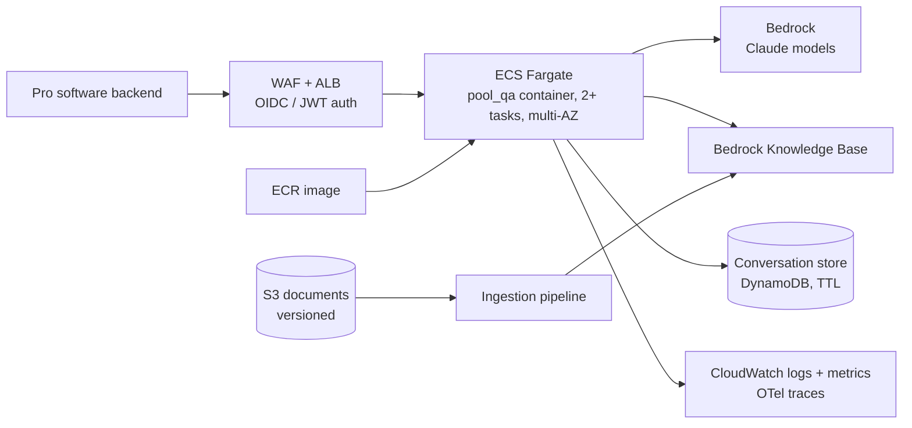

# Deployment

How this service would run in production on AWS. **Today** marks what the repository does now; everything else is proposed. Items marked *to verify* depend on AWS capabilities not checked for this draft. Design simplifications are listed once in `DESIGN.md` § Known limitations.

## 1. Scope

- Deployed unit: the `pool_qa` API (`POST /ask`), called by Fluidra's existing software for pool professionals. A standalone frontend could call the same API later; it would move user login, CORS and feedback collection to that frontend and raise abuse exposure.
- Users: pool professionals and support staff. Answers cite the documents or abstain; the technician remains responsible for the work.
- Corpus today: one manual, English pages indexed. Target: many brands, product lines, languages and document types, with service bulletins superseding manuals.
- **Today:** a container image (`Dockerfile`) serving the stateless API, configured by environment variables, with CI running lint and tests.

## 2. Target architecture

- **Region:** one EU region; Bedrock models through EU cross-region inference (*to verify*: model availability and that data stays in the EU).
- **Compute:** ECS Fargate. Tasks hold no state and are I/O-bound, so any task serves any turn and tasks scale on concurrent requests, not CPU. AgentCore Runtime is the alternative if the platform standardises on it; the LangGraph graph would move unchanged (*to verify*).
- **Entry:** ALB with WAF. A request can run up to the 180 s deadline, which exceeds API Gateway's default integration timeout (*to verify* current limits), so the ALB idle timeout is set above the deadline. Production streams progress to the caller or runs requests as async jobs; a synchronous request held up to 180 s is a Tier 0 simplification.
- **Models:** Bedrock replaces the Anthropic API. Tasks use an IAM role; no API keys.
- **Retrieval:** Bedrock Knowledge Base behind the existing `search()` interface.
- **Conversation state:** held server-side in a managed store, keyed by conversation and technician, expired per the retention policy. The client sends a conversation ID and the new message; the server loads history, so policies such as the clarification limit cannot be bypassed.

## 3. From repo to production

| Component | Today | Production |
|---|---|---|
| Model per agent | Config string, Anthropic API key | Bedrock model IDs via `langchain-aws` (new dependency); `llm.py` maps Bedrock errors to `ProviderError` (D29) |
| Structured output | Function calling | Same through Bedrock Converse tool use (*to verify* per model) |
| `search(query, filters, k)` | In-memory BM25 over `data/chunks.jsonl` | Knowledge Base retrieve with metadata filters; hybrid search (*to verify*). Citation and quote checks keep working on returned chunk text |
| Corpus | Committed JSONL, loaded at startup | Versioned index built by the ingestion pipeline |
| Config and secrets | `pydantic-settings`, `.env` | Task environment from SSM Parameter Store; no secrets needed with IAM |
| Conversation state | Client sends `history` | Server-side store keyed by conversation ID (requires a `CONTRACT.md` change) |
| Logs | One JSON line per graph node: `request_id`, ms, tokens per model | Same lines shipped to CloudWatch, plus OTel traces |
| Limits | LLM timeout, retries, 180 s deadline, 3 searches per Researcher run, 1 revision | Plus rate limits, input size caps, token budget per request (§6) |
| Build | `uv.lock`, Dockerfile, CI: ruff + pytest | Image built in CI, tagged with the commit SHA, pushed to ECR |

## 4. Knowledge pipeline

- Source documents in versioned S3 with metadata the `Chunk` schema already carries: `document`, `source_type`, `effective_date`, `language`. Product and brand are added as filter fields when the corpus holds several products.
- Ingestion runs offline, never in the request path. Each run builds a new index alongside the live one, never modifying it in place. The eval runs on the new index in staging; promotion switches the index ID the service reads, and the previous index is kept for rollback (Bedrock mechanism *to verify*).
- Before trusting managed parsing, check per document family against golden questions:
  - troubleshooting matrices keep the link between symptom and cause (plain text extraction lost it on page 13);
  - facts that exist only in figures (Fig. 4, installation zones) are recoverable or flagged as not covered;
  - page numbers and section headings survive, so citations point to a place the technician can open;
  - safety warnings stay in the same chunk as their procedure.
- Hand transcriptions (D27) do not scale; they are replaced by layout-aware parsing or VLM figure descriptions, checked the same way.
- **Languages:** Tier 0 indexes only English, which is valid only because this manual repeats the same content in every language. Production documents will not have parallel coverage, so all languages are indexed. Retrieval works across languages (multilingual embeddings or query translation), parallel passages are deduplicated, citations point to the page in the technician's language, and answers stay in that language.
- **Authority:** each document carries explicit `status` (active, superseded, withdrawn), `supersedes` (document or section IDs) and `applies_to` (products or models), set at ingestion by the document owner. Retrieval excludes withdrawn documents and prefers active ones; `source_type` and `effective_date` only break ties. Requires a `CONTRACT.md` change.

## 5. Release and evaluation

1. **Pipeline:** push → CI (lint, tests, image build) → staging deploy → eval gate → canary → production. Today CI runs lint and tests only.
2. **Infrastructure as code:** all infrastructure is defined as code (Terraform or CDK), reviewed like application code; staging and production come from the same definitions.
3. **Eval gate:** runs in staging when prompts, agents, models, retrieval or the index change, under a stated cost budget. Gates as in `DESIGN.md` § Evaluation.
4. **Eval robustness:** today the eval is manual, 5 questions, one run each; it informs releases but cannot block them. It blocks once the golden set is built with pilot technicians and support staff, stratified by product, language, document type and expected outcome (including injection attempts), and each question runs several times to report pass rates.
5. **Versioning:** a release is image SHA, prompt version, model IDs and index version; every answer is traceable to all four. Every eval result also records the golden set version, so results are comparable.
6. **Rollout and rollback:** canary on a share of traffic, compared with the current release on outcome mix, latency and error rate, then promoted. Alarms roll back automatically to the previous release as a whole.
7. **Pilot:** one market and one group of technicians before wider release.

## 6. Operations

### Observability

- **Today:** per-node JSON logs with latency, outcome, verdict, issues and token counts. Logs do not include question text; Verifier `issues` can quote answer content.
- Added: OTel traces per request covering agent steps and tool calls (Langfuse or CloudWatch as backend); `request_id` returned to the caller to join feedback to traces.
- Metrics and alarms: outcome mix (answer, clarify, abstain, refuse), revision rate, malformed-output rate, 502 and 504 rates, p50/p95 latency, tokens and cost per request.
- Quality monitoring: a sample of live traffic is scored offline by an LLM judge (a different model from the Verifier, calibrated against human review) for groundedness and relevance. Score drops alarm; low scores go to the review queue. Requires a retention policy for question text.

### Cost and latency

- An answered request makes several sequential model calls: Intake, a Researcher tool loop (one call per search plus submit, capped at 7 per run), the Verifier, and on revision a second Researcher run and Verifier call. In the Tier 0 eval every answer used its revision, so real traffic is likely near the long path. Latency and cost are measured from existing logs before setting targets.
- Controls: token budget per request, one search budget shared across revisions, per-user and per-tenant quotas, spend alarms.
- Experiments, gated by the eval: smaller Verifier model; single-agent baseline to measure what the multi-agent split costs and buys.

### Reliability

- **Today:** LLM timeout, retries with backoff on rate limit, server and connection errors, request deadline, malformed output ends as `abstain`, 502/504 on provider failure.
- Added: health check endpoint for the load balancer (not in `CONTRACT.md` yet); Bedrock quota increases sized from pilot traffic; fallback model or region on sustained provider errors.

### Feedback

- The pro software collects a rating and optional comment per answer, keyed by `request_id`.
- Low ratings and a sample of abstains go to a review queue; confirmed cases become golden questions.
- Pilot outcomes tracked with the business: first-time fix rate, time to resolution, technician satisfaction.

## 7. Security and compliance

- **Authentication:** calls come from the pro software backend with a token validated at the ALB; the technician identity arrives as a signed claim from the identity provider, validated by the service, not as a plain ID the caller could set. It scopes conversations, audit and quotas.
- **Abuse:** WAF rate limits; maximum question size and conversation length (requires a `CONTRACT.md` change).
- **Prompt injection:** today grounding is enforced on output only, by the citation check and Verifier. Production adds layered defences: user input and retrieved documents are passed as delimited data, never as instructions; agents get only the tools they need (search and read); input size limits; a managed guardrail service (e.g. Bedrock Guardrails, *to verify*); injection cases in the golden set.
- **Conversation integrity:** history is held server-side only, scoped to the authenticated technician; client-supplied history is not accepted.
- **Network and access:** private subnets, VPC endpoints for Bedrock and S3, least-privilege task role.
- **Data protection (GDPR):** EU region, log retention limits, no personal data in logs beyond the technician ID, Bedrock data-use terms reviewed (*to verify*).

## Open questions

- Expected traffic and concurrency per market.
- Identity provider and the software surface that will call the API.
- Acceptable response time, which decides between synchronous calls and streaming or async jobs.
- Which document families and languages come after this manual.
- Retention requirements for questions, answers and traces.
