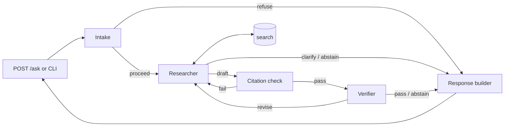

# Design

Multi-agent question answering over pool equipment documents for pool professionals. Rationale for every choice is in `DECISIONS.md`; schemas are in `CONTRACT.md`.

## Users and assumptions

- Users are mainly certified pool professionals. The tool is advisory; the user remains responsible for the work.
- Answers are grounded in the documents or the system abstains. No general pool knowledge.
- Corpus today: one multilingual manual (`data/user_manual.pdf`). Expected growth: potentially thousands of documents across brands, regions, languages, and document types.

## Tiers

Interfaces and schemas are final at Tier 0. Later tiers change implementations only. Every tier ends running, committed, and documented. Iterating in verticals.

| Tier | Contents | Exit |
|---|---|---|
| 0 | Crude text extraction of English pages (`pypdf`); BM25 inside `search()`; 3 agents with revision cap; `POST /ask` and CLI; 5 golden questions and eval command; draft deployment doc; README | End-to-end on 5 questions; 0 answers where abstain/refuse expected; citation IDs valid |
| 1 | Docling ingestion (tables, sections); hybrid retrieval; 14 golden questions | All evaluation gates pass |
| 2 | Judge validation; per-language page mapping; clarification cap enforced; deployment doc final | Judge–human agreement reported |
| Later | Cross-encoder reranker; Langfuse tracing; VLM figure descriptions; 25-question golden set; single-agent baseline; LangGraph checkpointer; structured safety warnings; rolling history summary | — |

## Architecture

- One revision in total per request, whether triggered by the citation check or the Verifier. Any failure after it → `abstain`.
- `clarify` and `abstain` from the Researcher skip verification.
- Citation check and response builder are code, not agents.
- The server is stateless. The client sends history; the server uses the first user turn plus the last 5 turns.
- Refusal messages are static phrases per language, English fallback.
- LLM calls have a timeout and retry with exponential backoff on rate limit, server, and connection errors; each request has an overall deadline. Provider failures return HTTP errors, not an outcome.

## Agents

| Agent | Model | Sees | Does |
|---|---|---|---|
| Intake | `claude-haiku-4-5` | Question, history | Relevance guardrail; detects user language; writes retrieval query in pivot language |
| Researcher | `claude-sonnet-5` | Intake output, question, history, revision issues; corpus via `search` | Bounded search calls; drafts in user language with chunk citations and verbatim quotes; includes safety instructions present in retrieved chunks; conditional answer when evidence branches; otherwise one clarifying question or abstain |
| Verifier | `claude-opus-5` | Question, draft, raw text of cited chunks | Claim-level grounding and answer relevance; returns `pass`, `revise(issues)`, or `abstain`; never writes content |

Models are config strings per agent. No provider-specific features.

## Ingestion

- Tier 0: `pypdf` text of the English section, chunked by page, split at numbered headings, page fallback and size cap (D19). `figure_refs` from "(Fig. N)" regex; `section` from heading patterns. Hand transcriptions (`data/transcriptions.jsonl`) replace pages whose content the text loses (D27).
- Tier 1: Docling. Tables keep row/column semantics inside chunks. Figure references attach to chunks. Exact representation fixed after a Docling spike.
- Parsed output is committed; the app runs without running ingestion.
- Every chunk carries all metadata fields, empty or null when unknown. `warning_ids` stays empty until structured safety warnings are implemented.

## Retrieval

- `search(query, filters, k) -> list[Chunk]` is the only corpus access.
- Tier 0 body: BM25 (`bm25s`). Tier 1 body: BM25 + dense (`multilingual-e5-small`) fused with reciprocal rank fusion.
- Vectors are an in-memory numpy array persisted to disk.
- Filters include `language`, set by code to the pivot language.
- Future: product/model filter once the corpus holds several products; Bedrock Managed Knowledge Base as an alternative implementation of the same interface.

## Languages

- Index: English only (pivot language).
- Answers: in the user's language.
- Citations: English page plus `page_in_language`, mapped via section page offsets from the manual index (Tier 2).

## Grounding and safety

- Every claim cites a chunk. Markers `[cN]` map 1:1 to citations.
- Citation IDs and quotes are validated in code before the Verifier runs.
- Safety instructions: Researcher prompt only; measured by `must_include` on safety golden questions. Response `warnings` is empty.
- Maximum one clarification per conversation (Tier 2 enforcement).

## Evaluation

Command: `uv run python -m pool_qa.eval.run`. Prints a table, writes a JSON report. Golden set: `eval/golden.jsonl`, dev-owned.

| Gate | Method | Threshold | From tier |
|---|---|---|---|
| Outcome matches expected | code | ≥ 13/14 | 1 |
| Answered where abstain/refuse expected | code | 0 | 0 |
| Citation IDs valid | code | 100% | 0 |
| Retrieval recall@k on `expected_pages` | code | ≥ 90% | 1 |
| Citation page in `expected_pages` | code | ≥ 90% | 1 |
| Answer language matches question | code | 100% | 1 |
| Unsupported claims (claim counts) | LLM judge | 0 | 1 |
| `must_include` coverage | LLM judge | ≥ 90% | 1 |
| Judge–human agreement on ~5 labelled answers | LLM judge vs dev | reported | 2 |

Gates not reachable in the current tier are reported as pending. The eval judge is separate from the Verifier.

Golden set composition (Tier 1): procedure 2, component table 1, troubleshooting matrix 2, figure reference 1, safety 2 (key warning in `must_include`), non-English 2, not in manual 2, off-topic 1, ambiguous 1.

## Known limitations

Simplifications built into this design, and what changes at scale.

| Limitation | At scale |
|---|---|
| English-only index; assumes identical facts across languages; per-language pages mapped by section offset | Multilingual indexing with dedup of parallel passages and passage-level translation linkage |
| Single document: no product/model filter, no authority or recency ranking | Product/model filters; document type and effective date ranking, bulletins superseding manuals |
| Figures handled as references only; diagram content (e.g. wiring) is not readable | VLM figure descriptions or figure-level retrieval |
| Safety warnings not structured; covered by Researcher prompt and `must_include` only | Warnings as structured source data linked to procedures, attached in code and gated in eval |
| In-memory vector array | Managed vector store (e.g. OpenSearch, Bedrock Knowledge Base) behind the same `search` interface |
| No prompt-injection defences; client-held history can be forged (e.g. fake assistant turns bypass the clarification cap) | Input guardrails; server-side or signed history |
| Search cap applies per Researcher run; a revision can bring a request to 6 searches | Search budget per request, shared across revisions |
| Revision sees only the issues, not the rejected draft or its retrieved chunks | Revision receives the rejected draft and its chunks |
| Verifier and eval judge share model family with the Researcher | Different-family judge; periodic human labelling |
| Stateless server: no sessions, no audit trail | Server-side sessions with persisted traces |
| Chunking validated on one manual only | Chunk quality checked per new document family before indexing |
| 14 golden questions: directional, not statistically significant | Larger set built from real user questions |
| Eval is one run per question on nondeterministic models; results are not stable behaviour | Repeated runs per question with pass rates |
| No auth, rate limiting, or tracing | Provided by the target platform (see deployment document) |

## Stack

Python 3.12, `uv`, `pypdf`, `docling`, `bm25s`, `PyStemmer`, `sentence-transformers`, numpy, `langgraph`, `langchain`, `langchain-anthropic`, `pydantic` v2, `pydantic-settings`, `fastapi`, `uvicorn`, `argparse`, `lingua-language-detector`, `pytest`, `httpx` (dev), `ruff` (dev).

## Deliverables

- Code.
- `README.md`: how to run, scope, assumptions, professional-responsibility position.
- Deployment document: AWS target, what is replaced by managed services (Bedrock, Managed Knowledge Bases, AgentCore), what to verify before trusting managed ingestion, language-scaling limitation.
